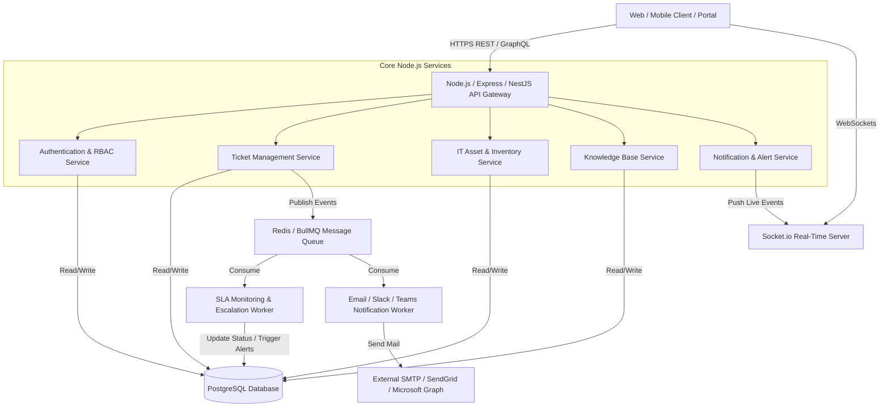
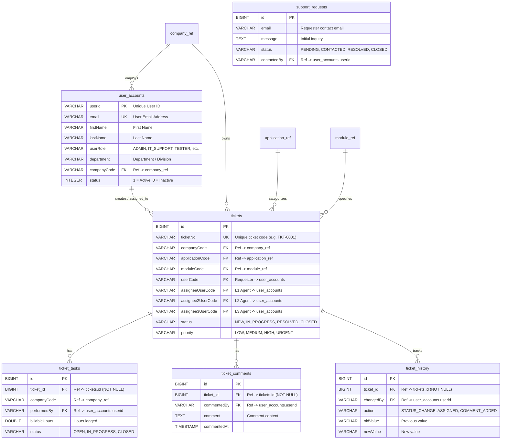
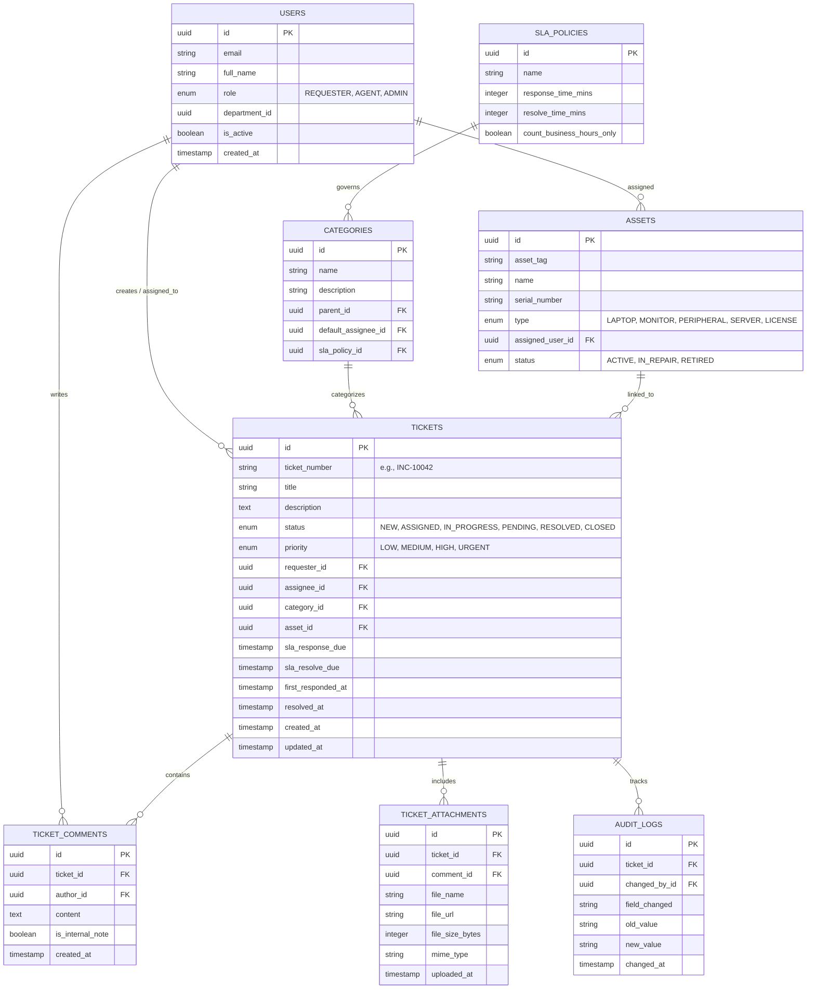
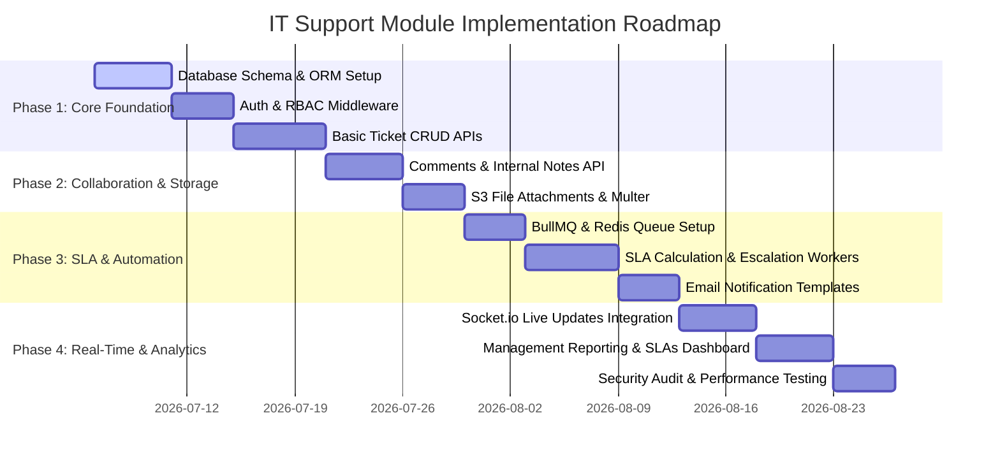

# IT Support & Helpdesk Module — Technical Blueprint (Node.js)

This document serves as a complete technical architectural blueprint and implementation guide for building an **IT Support & Helpdesk Module** using **Node.js**. 

---

## Table of Contents
1. [Executive Summary & System Objectives](#1-executive-summary--system-objectives)
2. [High-Level System Architecture](#2-high-level-system-architecture)
3. [Core Functional Modules](#3-core-functional-modules)
4. [User Roles & Access Control (RBAC)](#4-user-roles--access-control-rbac)
5. [Database Schema & ER Diagram](#5-database-schema--er-diagram)
6. [API Endpoints Design](#6-api-endpoints-design)
7. [Real-Time Communication & WebSockets](#7-real-time-communication--websockets)
8. [Background Workers & SLA Escalation Engine](#8-background-workers--sla-escalation-engine)
9. [Recommended Technology Stack & NPM Packages](#9-recommended-technology-stack--npm-packages)
10. [Implementation Roadmap & Phased Delivery](#10-implementation-roadmap--phased-delivery)
11. [Security & Performance Best Practices](#11-security--performance-best-practices)

---

## 1. Executive Summary & System Objectives

The **IT Support Module** is designed to streamline enterprise technical assistance, incident management, asset tracking, and service request fulfillment. By utilizing an event-driven Node.js architecture, the module ensures high concurrency, real-time status updates, automated SLA tracking, and seamless integration with existing enterprise authentication systems (e.g., Active Directory, Google Workspace, Okta).

### Key Objectives:
- **Centralized Incident Management:** Single pane of glass for reporting and resolving technical issues.
- **Automated Workflow Routing:** Smart assignment of tickets based on category, technician workload, and expertise.
- **SLA & Escalation Governance:** Proactive tracking of response and resolution timelines with automated alerts for impending breaches.
- **Self-Service & Deflection:** Integrated Knowledge Base (KB) to suggest solutions before ticket submission.
- **Audit & Compliance:** Complete immutable historical logs of all ticket modifications, internal communications, and status transitions.

---

## 2. High-Level System Architecture

The module is designed as a modular monolith (or standalone microservice) built on **Node.js**, leveraging a relational database (**PostgreSQL**) for transactional integrity, **Redis** for caching and job queues, and **WebSockets** for live UI updates.




---

## 3. Core Functional Modules


### 3.1. Ticket Lifecycle Management
* **Creation:** Support for multi-channel creation (Web Portal, Email-to-Ticket, API integration).
* **Categorization:** Hierarchical categories (e.g., `Hardware > Laptop`, `Software > ERP`, `Network > VPN`).
* **Prioritization:** Dynamic SLA calculation based on Impact and Urgency matrix (`Low`, `Medium`, `High`, `Urgent`).
* **Status Lifecycle:** 
  ```mermaid
  stateDiagram-v2
      [*] --> New: Ticket Created
      New --> Assigned: Auto/Manual Routing
      Assigned --> InProgress: Technician Starts Work
      InProgress --> PendingUser: Awaiting User Info / Approval
      PendingUser --> InProgress: User Responds
      InProgress --> Resolved: Solution Provided
      Resolved --> Closed: Automated (after 72h) or User Confirmed
      Resolved --> InProgress: Reopened by User
      Closed --> [*]
  ```

### 3.2. SLA & Escalation Engine
* Tracks **First Response Time (FRT)** and **Mean Time to Resolution (MTTR)**.
* Configurable business hours and holiday calendars per department/timezone.
* Automated multi-tier escalation:
  * *Level 1 Warning:* 80% of SLA time elapsed without resolution $\rightarrow$ Alert Technician.
  * *Level 2 Breach:* 100% of SLA time elapsed $\rightarrow$ Reassign or Alert IT Team Lead / Manager.

### 3.3. Asset & Inventory Linkage (CMDB Lite)
* Link tickets directly to specific IT assets (e.g., Tag `#LT-2024-009` MacBook Pro).
* View complete ticket history per asset to identify recurring hardware failures.

### 3.4. Communication & Collaboration
* **Public Comments:** Visible to both end-users and IT agents.
* **Internal Notes:** Private notes visible only to IT support technicians and admins.
* **Attachments:** Support for screenshots, log files, and PDFs with antivirus scanning and secure S3/local storage.

---

## 4. User Roles & Access Control (RBAC)

| Role | Permissions & Capabilities |
| :--- | :--- |
| **Requester (Employee)** | Create tickets, view own tickets, respond to technician questions, close own resolved tickets, search Knowledge Base. |
| **Helpdesk Agent (L1/L2)** | View assigned queue and unassigned pool, claim/reassign tickets, add internal notes, modify ticket status, link assets. |
| **IT Specialist / SME (L3)** | Handle escalated tickets, manage complex problem tickets, publish Knowledge Base articles. |
| **IT Supervisor / Manager** | View global dashboards, configure SLA rules and business hours, override assignments, export audit reports. |
| **System Administrator** | Full system access, RBAC management, API key generation, custom workflow configuration, category management. |

---

## 5. Database Schema & ER Diagram

We recommend **PostgreSQL** using **Prisma ORM** or **TypeORM** for type-safe database queries.

### 5.1. Live Codebase Schema (Spring Boot JPA Entities & SQL DDL)
This schema reflects the active Java Spring Boot JPA entities (`Ticket`, `TicketTask`, `TicketComment`, `TicketHistory`, `SupportRequest`, and `SupportIssueType`) currently implemented in the codebase.



#### SQL Schema Creation (DDL)
```sql
-- 1. Master User Accounts Table
CREATE TABLE user_accounts (
    userid VARCHAR(255) PRIMARY KEY,
    password VARCHAR(100),
    first_name VARCHAR(255),
    last_name VARCHAR(255),
    email VARCHAR(255) NOT NULL UNIQUE,
    phone_no VARCHAR(50),
    whatsapp_no VARCHAR(50),
    requester_name VARCHAR(255),
    created_date TIMESTAMP DEFAULT CURRENT_TIMESTAMP,
    status INTEGER DEFAULT 1,
    deactivated_date TIMESTAMP,
    access_level1 VARCHAR(255),
    access_level2 VARCHAR(255),
    access_level3 VARCHAR(255),
    country_code VARCHAR(50),
    country_name VARCHAR(255),
    division VARCHAR(255),
    department VARCHAR(255),
    location VARCHAR(255),
    user_title VARCHAR(255),
    user_role VARCHAR(255),
    reporting_manager VARCHAR(255),
    language VARCHAR(100),
    emergency_contact_no VARCHAR(50),
    license VARCHAR(255),
    reset_token VARCHAR(255),
    company_code VARCHAR(255),
    CONSTRAINT fk_user_company FOREIGN KEY (company_code) REFERENCES company_ref(company_code)
);

-- 2. Support Issue Categories
CREATE TABLE support_issue_type (
    id BIGINT AUTO_INCREMENT PRIMARY KEY,
    name VARCHAR(255) NOT NULL UNIQUE
);

-- 3. Core Tickets Table
CREATE TABLE tickets (
    id BIGINT AUTO_INCREMENT PRIMARY KEY,
    ticket_no VARCHAR(255) UNIQUE,
    issue_code VARCHAR(255),
    company_code VARCHAR(255),
    application_code VARCHAR(255),
    module_code VARCHAR(255),
    test_case_code VARCHAR(255),
    test_case_transaction_code VARCHAR(255),
    issue_type VARCHAR(255),
    issue_description TEXT,
    issue_long_description TEXT,
    error_code VARCHAR(255),
    status VARCHAR(50),
    priority VARCHAR(50),
    datetime TIMESTAMP,
    user_code VARCHAR(255),
    attachments TEXT,
    attachment_paths VARCHAR(1000),
    assignee_user_code VARCHAR(255),
    assignee_name VARCHAR(255),
    assignee_expected_date1 DATE,
    assignee1_notes TEXT,
    assignee1_resolution TEXT,
    assignee1_resolved_date DATE,
    assignee2_user_code VARCHAR(255),
    assignee2_expected_date DATE,
    assignee2_notes TEXT,
    assignee2_resolution TEXT,
    assignee2_resolved_date DATE,
    assignee3_user_code VARCHAR(255),
    assignee3_expected_date DATE,
    assignee3_notes TEXT,
    assignee3_resolution TEXT,
    assignee3_resolved_date DATE,
    additional_comments TEXT,
    ticket_closed_date DATE,
    ticket_closed_name VARCHAR(255),
    closing_notes TEXT,
    CONSTRAINT fk_ticket_user FOREIGN KEY (user_code) REFERENCES user_accounts(userid),
    CONSTRAINT fk_ticket_assignee1 FOREIGN KEY (assignee_user_code) REFERENCES user_accounts(userid),
    CONSTRAINT fk_ticket_company FOREIGN KEY (company_code) REFERENCES company_ref(company_code)
);

-- 4. Ticket Tasks (Work Breakdown & Billable Hours)
CREATE TABLE ticket_tasks (
    id BIGINT AUTO_INCREMENT PRIMARY KEY,
    ticket_id BIGINT NOT NULL,
    company_code VARCHAR(255),
    task_type VARCHAR(255),
    description_of_work_done TEXT,
    billable_hours DOUBLE,
    start_date DATE,
    completed_date DATE,
    committed_date DATE,
    performed_by VARCHAR(255),
    requestor_task VARCHAR(255),
    comments TEXT,
    status VARCHAR(50),
    last_modified_by VARCHAR(255),
    last_modified_at TIMESTAMP,
    CONSTRAINT fk_task_ticket FOREIGN KEY (ticket_id) REFERENCES tickets(id) ON DELETE CASCADE,
    CONSTRAINT fk_task_performed_by FOREIGN KEY (performed_by) REFERENCES user_accounts(userid)
);

-- 5. Ticket Comments (Collaboration & Notes)
CREATE TABLE ticket_comments (
    id BIGINT AUTO_INCREMENT PRIMARY KEY,
    ticket_id BIGINT NOT NULL,
    comment TEXT NOT NULL,
    commented_by VARCHAR(255),
    commented_at TIMESTAMP DEFAULT CURRENT_TIMESTAMP,
    attachment_path VARCHAR(1000),
    CONSTRAINT fk_comment_ticket FOREIGN KEY (ticket_id) REFERENCES tickets(id) ON DELETE CASCADE,
    CONSTRAINT fk_comment_user FOREIGN KEY (commented_by) REFERENCES user_accounts(userid)
);

-- 6. Ticket History (Audit Log)
CREATE TABLE ticket_history (
    id BIGINT AUTO_INCREMENT PRIMARY KEY,
    ticket_id BIGINT NOT NULL,
    action VARCHAR(255),
    old_value VARCHAR(1000),
    new_value VARCHAR(1000),
    description TEXT,
    changed_by VARCHAR(255),
    changed_at TIMESTAMP DEFAULT CURRENT_TIMESTAMP,
    CONSTRAINT fk_history_ticket FOREIGN KEY (ticket_id) REFERENCES tickets(id) ON DELETE CASCADE,
    CONSTRAINT fk_history_user FOREIGN KEY (changed_by) REFERENCES user_accounts(userid)
);

-- 7. Support Requests (Helpdesk Intake / Contact Requests)
CREATE TABLE support_requests (
    id BIGINT AUTO_INCREMENT PRIMARY KEY,
    name VARCHAR(255) NOT NULL,
    email VARCHAR(255) NOT NULL,
    phone VARCHAR(50),
    company_name VARCHAR(255),
    subject VARCHAR(500) NOT NULL,
    message TEXT NOT NULL,
    status VARCHAR(50) DEFAULT 'PENDING',
    created_at TIMESTAMP DEFAULT CURRENT_TIMESTAMP,
    contacted_at TIMESTAMP,
    contacted_by VARCHAR(255),
    admin_notes TEXT,
    CONSTRAINT fk_support_req_admin FOREIGN KEY (contacted_by) REFERENCES user_accounts(userid)
);
```

### 5.2. Extended Enterprise Blueprint Schema (Node.js Reference)
The following ER diagram illustrates the extended target architecture for full CMDB asset linkage and automated SLA governance:



---

## 6. API Endpoints Design

All endpoints should be prefixed with `/api/v1/support`. Authentication via **JWT Bearer Token** is required for all routes.

### 6.1. Tickets API
| Method | Endpoint | Description | Allowed Roles |
| :--- | :--- | :--- | :--- |
| `POST` | `/tickets` | Create a new support ticket | All Authenticated Users |
| `GET` | `/tickets` | List tickets (with pagination, filtering by status/priority/assignee) | Requesters (own only), Agents/Admins (all) |
| `GET` | `/tickets/:id` | Get detailed ticket info along with comments & attachments | Requester, Assigned Agent, Admins |
| `PATCH` | `/tickets/:id` | Update ticket details (title, category, priority) | Agents, Admins |
| `PATCH` | `/tickets/:id/status`| Transition ticket status (e.g., `IN_PROGRESS` $\rightarrow$ `RESOLVED`) | Agents, Requesters (for Close/Reopen) |
| `POST` | `/tickets/:id/assign` | Assign or reassign ticket to an agent or team | Agents, Admins |
| `DELETE` | `/tickets/:id` | Soft delete or archive a spam/erroneous ticket | Admins |

### 6.2. Comments & Attachments API
| Method | Endpoint | Description | Allowed Roles |
| :--- | :--- | :--- | :--- |
| `GET` | `/tickets/:id/comments` | Get conversation thread (filters out internal notes for Requesters) | All authorized for ticket |
| `POST` | `/tickets/:id/comments` | Add a public reply or internal technician note | All authorized (`is_internal_note` locked to Agents) |
| `POST` | `/tickets/:id/upload` | Upload diagnostic attachment (Multipart form-data) | All authorized for ticket |

### 6.3. Metadata & Admin API
| Method | Endpoint | Description | Allowed Roles |
| :--- | :--- | :--- | :--- |
| `GET` | `/categories` | Fetch active IT support categories hierarchy | All Users |
| `GET` | `/assets/my-assets` | List hardware/software assigned to current user | Requesters |
| `GET` | `/analytics/metrics` | Get SLA compliance rate, average MTTR, open ticket volume | Managers, Admins |

---

## 7. Real-Time Communication & WebSockets

Using **Socket.io**, the module provides instant feedback without page refreshes:
* **Connection & Authentication:** Client connects with JWT token; server joins the client socket to personal rooms (e.g., `user_room_{userId}`, `role_room_agents`).
* **Event Triggers:**
  * `ticket:created`: Emitted to `role_room_agents` when a new unassigned ticket arrives.
  * `ticket:updated`: Emitted to the ticket creator and assigned agent when status changes.
  * `comment:added`: Live streaming of new replies inside open ticket views.
  * `user:typing`: Indicator when an agent is currently drafting a reply.

---

## 8. Background Workers & SLA Escalation Engine


Using **BullMQ** backed by **Redis**, background workers handle asynchronous tasks:

1. **SLA Monitoring Cron / Delay Queue:**
   * When a ticket is created, calculate `sla_response_due` and `sla_resolve_due`.
   * Schedule a delayed job in BullMQ to trigger 15 minutes before the due deadline.
   * If the job triggers and ticket status is still `NEW` or `IN_PROGRESS`, dispatch an urgent escalation notification via email/Slack and mark ticket alert flag.
2. **Email & Notification Processing:**
   * Offload email dispatching (e.g., Nodemailer / SendGrid API) to background workers to prevent blocking the HTTP response loop during ticket creation.
3. **Auto-Archiving Worker:**
   * Runs daily at midnight (`0 0 * * *`) to transition tickets that have been in `RESOLVED` status for over 72 hours into `CLOSED` status.

---

## 9. Recommended Technology Stack & NPM Packages

| Layer / Requirement | Recommended Package / Tool | Rationale |
| :--- | :--- | :--- |
| **Runtime & Framework** | Node.js (v20+ LTS) + Express.js / NestJS | Fast, asynchronous I/O; NestJS provides excellent structure for modular enterprise systems. |
| **Language** | TypeScript | Eliminates runtime type bugs and provides clean DTO contracts. |
| **Database ORM** | Prisma ORM (`@prisma/client`) | Best-in-class developer experience, auto-generated migrations, and strict type safety. |
| **Validation** | Zod (`zod`) | Schema declaration and validation for API request bodies, params, and env variables. |
| **Authentication** | Passport.js / `jsonwebtoken` / `bcryptjs` | Standard JWT bearer auth + SSO integration capabilities (SAML / OAuth2). |
| **Job Queue & Caching** | BullMQ (`bullmq`) + `ioredis` | Robust Redis-based background job processing for SLAs and automated workflows. |
| **Real-Time** | Socket.io (`socket.io`) | Reliable WebSockets with automatic fallback and room-based broadcasting. |
| **File Uploads** | Multer (`multer`) + `@aws-sdk/client-s3` | Stream file attachments directly to AWS S3 / MinIO object storage. |
| **Logging** | Winston (`winston`) or Pino (`pino`) | High-performance structured JSON logging with log rotation and external alerting. |
| **Email Sending** | Nodemailer (`nodemailer`) + Handlebars | Templated transactional emails for ticket confirmations and updates. |

---

## 10. Implementation Roadmap & Phased Delivery



### Phase 1: Core Foundation (Weeks 1–2)
- Set up Node.js / TypeScript project structure and ESLint/Prettier configs.
- Design and migrate PostgreSQL database using Prisma ORM.
- Implement JWT Auth, RBAC middleware, and basic CRUD endpoints for Categories and Tickets.

### Phase 2: Collaboration & File Storage (Weeks 3–4)
- Build public commenting and private technician note functionality.
- Integrate Multer and AWS S3 SDK for secure file attachment upload and download.
- Add asset inventory linking endpoints.

### Phase 3: SLA Engine & Async Workflows (Weeks 5–6)
- Integrate Redis and BullMQ.
- Build the SLA calculation service (accounting for business hours).
- Create background escalation workers and automated email/Slack notifications.

### Phase 4: Real-Time Experience & Polish (Weeks 7–8)
- Integrate Socket.io for instant desktop notifications and real-time UI synchronization.
- Build management analytics endpoints (SLA compliance, ticket volume heatmaps).
- Conduct load testing, API rate-limiting setup, and final deployment documentation.

---

## 11. Security & Performance Best Practices

1. **Input Sanitization & Protection:**
   * Use `helmet` middleware to set secure HTTP headers.
   * Strip HTML tags or sanitize markdown using `DOMPurify` / `sanitize-html` before storing ticket descriptions and comments to prevent Stored Cross-Site Scripting (XSS).
   * Enforce strict rate limiting on `/tickets` creation endpoint using `express-rate-limit` to prevent denial-of-service (DoS) or ticket spamming.
2. **Access Security:**
   * Never expose internal technician notes (`is_internal_note = true`) in queries where the requesting user's role is `REQUESTER`.
   * Generate pre-signed URLs with short expiration times (e.g., 15 minutes) for file attachments stored in S3 rather than exposing public buckets.
3. **Database Performance:**
   * Index frequently queried columns: `status`, `priority`, `requester_id`, `assignee_id`, and `sla_resolve_due`.
   * Use pagination (`limit` and `cursor` / `offset`) for all ticket list queries; never return unbounded lists.
4. **Resilience & Monitoring:**
   * Implement graceful shutdown in Node.js to finish processing active BullMQ jobs and close database pools before terminating the process.
   * Integrate error monitoring tools like **Sentry** to capture unhandled promise rejections or database connection timeouts.
