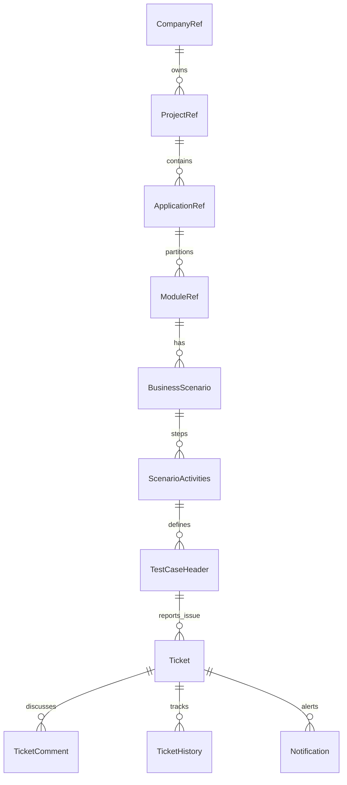

# PerfectQA (Testing Tool) - Project Documentation

## 📜 Project Purpose & Overview
**PerfectQA** is a comprehensive Quality Assurance (QA) and Project Management suite built using Spring Boot and JPA. It is designed to manage the entire testing lifecycle, providing a structured way to define projects, track test execution, and manage software defects.

### Key Objectives:
1.  **Centralized Repository**: Store all project meta-data, test scenarios, and test cases in one place.
2.  **Defect Tracking**: Provide a robust ticket management system to report, assign, and resolve bugs.
3.  **Hierarchy Management**: Organize testing activities into neat levels: Company → Project → Application → Module → Scenario.
4.  **Audit & History**: Track changes, comments, and resolutions for every issue reported.

---

## 🛠️ Core Features & Examples

### 1. Project Organization
The tool allows multi-tenant/multi-company management. Each company can have multiple projects, and each project can have several applications.
*   **Example**: 
    *   **Company**: *Star Health*
    *   **Project**: *Digital Transformation 2024*
    *   **Application**: *Customer Portal*, *Claims Engine*, *Provider Portal*

### 2. Test Management
Test cases are built from business scenarios.
*   **Scenario**: "User logs in and checks claim status."
*   **Activities**: 
    1. Navigate to Login Page.
    2. Enter Credentials.
    3. Click on 'My Claims' tab.
*   **TestCase Header**: Stores prerequisites, expected results, and actual status.

### 3. Ticket Lifecycle (Defect Tracking)
When a test case fails, a **Ticket** is created.
*   **Status Flow**: `OPEN` → `ASSIGNED` → `IN_PROGRESS` → `RESOLVED` → `CLOSED` (or `REOPENED`).
*   **Assignees**: Supports up to three sequential assignees for complex resolution workflows.
*   **Attachments**: Allows uploading screenshots of bugs.

---

## 🏗️ Entity Relationship Diagram

---

## 📋 Data Model Details

| Entity | Purpose | Key Fields |
| :--- | :--- | :--- |
| **ProjectRef** | High-level project info | Project Code, Project Name, Sponsors, Goals |
| **ModuleRef** | Tracks module owners & dates | Module Key, Lead Tester, Start/End Dates |
| **TestCaseHeader** | The core "what to test" | Activity, Expected Outcome, T-Code, Prerequisites |
| **Ticket** | The core "bug report" | Issue Description, Status, Priority, Assignees |
| **UserAccount** | Authentication & Roles | User Code, Roles, Email, Password |

---

## 🚀 Suggested New Modules & Enhancements

To make the system even more premium and functional, consider including these modules:

1.  **📊 QA Dashboard & Analytics**:
    *   Visual charts (Pie/Line) showing "Bugs by Status", "Testing Progress (%)", and "Tester Performance".
    *   Use libraries like Chart.js or D3.js.

2.  **🛡️ Role-Based Access Control (RBAC)**:
    *   Fine-grained permissions for SuperAdmin, ProjectManager, Tester, and Developer.
    *   Currently, the system uses basic `UserAccount`. Enhancing this with Spring Security and dynamic permissions would be beneficial.

3.  **🤖 Automated Test Integration**:
    *   A module to trigger Selenium or REST-assured scripts and automatically update `TestCaseHeader` status based on the execution result.

4.  **⏱️ SLA & Deadline Tracking**:
    *   Automatically flag tickets that have exceeded their "Expected Resolution Date".
    *   Send email reminders via `Notification` service.

5.  **📚 Knowledge Base (Wiki)**:
    *   A space for teams to document common configurations, T-Codes, and troubleshooting steps for specific modules.

6.  **🔄 Integration with Jira/Azure DevOps**:
    *   Syncing tickets with external industry-standard tools.

7.  **🌙 Theme Customization (Dark Mode)**:
    *   Enhance the UI/UX with modern CSS variables to allow users to switch themes.
